<div align="center">

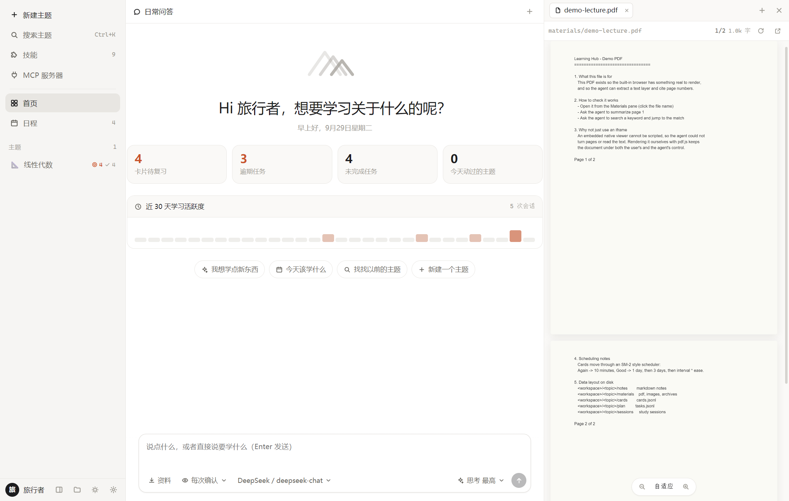

# Learning Hub · 学习中枢

**A local-first AI study companion that covers the whole learning loop: preview → learn → review → test.**

It plans a lesson before it teaches, cites the page it read, writes your notes and flashcards to plain
Markdown, and quizzes you the way a medical school exam does.

[](LICENSE)
[](#install)
[](https://tauri.app)
[](src-tauri)
[](src)

[中文说明](README.zh-CN.md) · [Architecture](docs/ARCHITECTURE.md) · [Agent notes](AGENTS.md)

</div>

> **Note on language:** the interface is currently Chinese-only; an English UI is on the roadmap.
> The screenshots below show the real Chinese interface. This README is the English entry point.

---

## Table of contents

- [Why another study app](#why-another-study-app)
- [Feature tour](#feature-tour)
  - [1. Topics are folders](#1-topics-are-folders)
  - [2. Chat that actually does things](#2-chat-that-actually-does-things)
  - [3. Organising the chats themselves](#3-organising-the-chats-themselves)
  - [4. Built-in browser the agent can drive](#4-built-in-browser-the-agent-can-drive)
  - [5. Teach mode: plan first, then one step at a time](#5-teach-mode-plan-first-then-one-step-at-a-time)
  - [6. Knowledge base from your own lecture notes](#6-knowledge-base-from-your-own-lecture-notes)
  - [7. Quizzes in real exam formats](#7-quizzes-in-real-exam-formats)
  - [8. Flashcards, spaced repetition, Anki sync](#8-flashcards-spaced-repetition-anki-sync)
  - [9. Mind maps and diagrams](#9-mind-maps-and-diagrams)
  - [10. WYSIWYG Markdown editor](#10-wysiwyg-markdown-editor)
  - [11. Skills and MCP](#11-skills-and-mcp)
  - [12. Long-term memory](#12-long-term-memory)
  - [13. Sandbox, permissions, schedule](#13-sandbox-permissions-schedule)
- [Install](#install)
- [Configuration](#configuration)
- [How it works](#how-it-works)
- [Development](#development)
- [Roadmap](#roadmap)
- [Acknowledgements](#acknowledgements)
- [License](#license)

---

## Why another study app

Most AI chat clients forget everything the moment you close the tab, and most note apps have never read
a textbook. Learning Hub sits in between: an agent whose **memory lives on your disk**, arranged the way
studying actually works.

Three decisions shape everything:

| Decision | Why |
| --- | --- |
| **A topic is a directory** | Notes are `.md`, cards are `.jsonl`, materials stay as the original PDFs. Open the folder in VS Code, sync it however you like, and delete the app without losing work. |
| **The agent is a study partner, not a chatbot** | It writes notes, makes cards, schedules review, and is instructed to explain one small step and then ask you a question — instead of dumping ten bullet points. It also keeps **long-term memory about you**: your level, how you like to be taught, the points you keep getting wrong. All of it in a `.jsonl` you can read and edit. |
| **Everything is citeable** | When it reads page 12 of your lecture PDF, it says so, and the citation is one click away in the built-in viewer. |

Rust backend (no Electron), Tauri 2 shell, React 19 front end. Fully offline except for the model API
you configure.

---

## Feature tour

### 1. Topics are folders

The sidebar lists your topics — one directory each. The header of every topic shows what is inside:
notes, materials, cards due today, open tasks, sessions.


Create one with **New topic**, search across every note with **Ctrl+K**, and drag files from Explorer
straight into the window to import them into that topic's `materials/`.

Every topic expands in the sidebar: **its sub-topics and its past conversations hang under it** (a
parent's conversations under the parent, a chapter's under the chapter). Click one to jump back into
that chat — no digging through a dropdown in the chat header.
**Hold a conversation and drop it on another topic row** to file it there (move a course-wide chat into a chapter, or back up to the parent).

#### Only studying one chapter? Make it a sub-topic

Often you do not want the whole course — just chapter 3. Pick **More → New sub-topic (study one chapter)**
on a topic and it becomes a *chapter* of that course:

- It shows up indented and collapsible in the sidebar, with a `Linear Algebra › Chapter 3` breadcrumb in
  the header that jumps back to the parent.
- **Materials come along**: the parent's handouts, `kb/` files and notes are readable, listed in their own
  group marked *inherited from "Linear Algebra" (read-only)* — no re-importing the same PDF.
- **Narrower context**: the agent's main line becomes this chapter, and the course material becomes
  background. The knowledge base indexes the parent's handouts too, and cites them as
  `Linear Algebra/materials/lecture1.pdf p.12` — click it and that file opens.
- **Independent state**: notes, cards, review queue and plan stay per chapter, so "this chapter's review
  queue" really only contains this chapter's cards.
- Per-topic skill/MCP switches are inherited down the chain, and deleting a parent moves its chapters to
  the trash with it (restore the folders and the relationships come back).

(The hierarchy lives in `parent` inside `topic.json`; the directories stay flat under the workspace root,
so the file layout stays obvious in Explorer.)

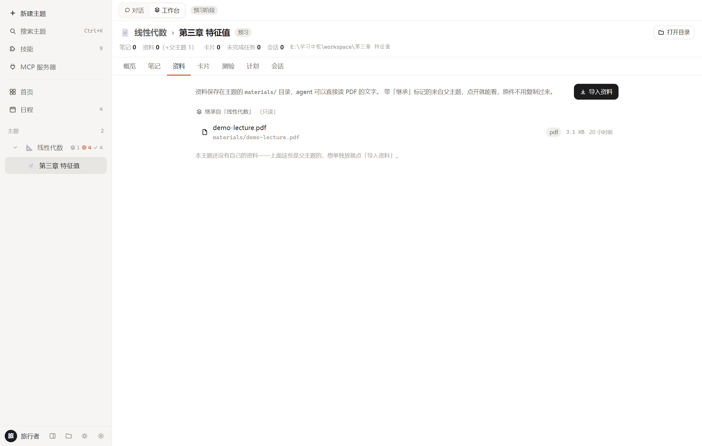

### 2. Chat that actually does things

The agent has 43 built-in tools grouped by purpose: files, study assets, the built-in browser, web
access, quizzes, the knowledge base, lesson plans, mind maps, skills and MCP.

- **Every write shows up as a card**, with what it touched, how long it took and whether it succeeded.
- **Writes ask first** — three permission levels: ask / auto-edit / full access.
- **Thinking effort** sits next to the model picker: off / low / medium / high / max. Off by default
  (the field is a non-standard extension, so it is only sent once you turn it on); the sending style
  (`reasoning_effort` / `enable_thinking` / Anthropic `thinking`) is selectable per profile in Settings.
- **Its documents are your documents**: notes, cards and quizzes are ordinary files you can edit by hand.

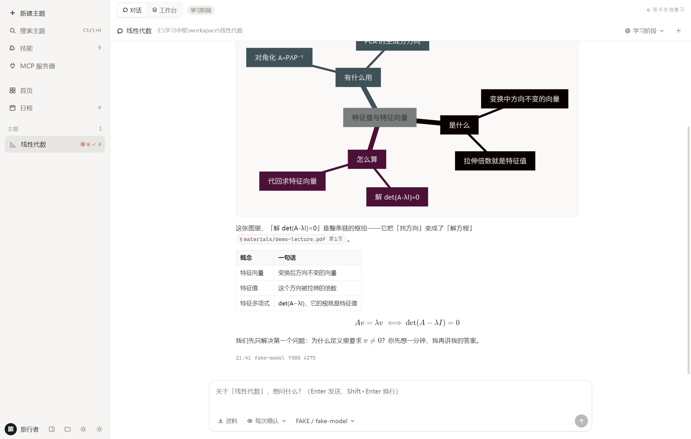

The small pills at the end of that paragraph are citations. Click one and the built-in browser opens
the PDF at that page.

### 3. Organising the chats themselves

A topic's chats are listed under it in the sidebar, and hovering a row reveals a `⋯` menu:

- **Rename** — inline; clear the name to fall back to the auto title (the first thing you asked).
- **Pin** — keeps a chat at the top of its topic. Pinned chats are never pushed out by the list cap.
- **Fork** — copies the conversation *up to its last complete exchange* into a new chat, leaving the
  original untouched. This is how you say "explain it differently from here" without polluting the
  thread that finally made sense — and the fork remembers where it came from.
- **Archive** — files the chat under a muted *Archived* group inside its topic. It stays searchable and
  the agent still sees it; it just stops taking up room. Un-archive puts it back.

Deleting moves the transcript to `.hub/trash/` like everything else. All of this lives in a tiny
sidecar file next to the transcript (`<id>.meta.json`) — your `chats/<id>.jsonl` stays exactly
"one message per line", so nothing that reads conversations has to learn a special format.

### 4. Built-in browser the agent can drive

PDF, Markdown, web pages, images and code — tabbed, in a side panel.

- **PDF** is rendered page by page with pdf.js, so the agent can jump to page 12 and quote it. The text
  layer is real: you can select and copy, and search hits are highlighted on the text itself.
- **Web** pages are embedded, plus a **reader mode** that shows exactly what the agent extracted.
- **`viewer_*` tools** let the agent open files, turn pages, search inside a document and scroll to a
  hit while you watch.

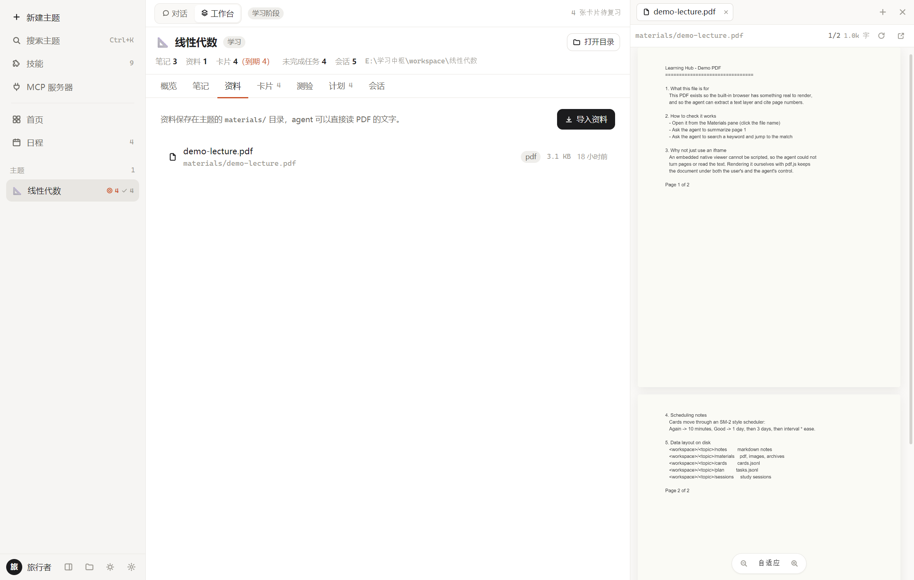

### 5. Teach mode: plan first, then one step at a time

A **collapsible progress card** sits at the top-right of the conversation (e.g. `3/6 · step 4 …`): every step of
 the plan, struck through when covered, the current one highlighted, with its “how do I check you got it”
 line when expanded. You can see where you are without leaving the chat.

Preview defaults to teach mode. The agent must do three things in order:

1. **Search your lecture notes** to find what your teacher emphasised.
2. **Write a lesson plan** — 4–8 steps, each with *what it explains* and *how it checks you understood*.
   The plan is stored as a file and injected into every later turn, so it never loses its place.
3. **Teach one step, then stop and ask.** Only after you answer does it move on.

Optionally it writes an interactive HTML demo (draggable parameters, animations) into `lessons/` and
opens it in the viewer. It also names your prerequisites — *"you already covered this in your Calculus
topic, it was theorem 3.2"* — by reading the notes of your other topics.

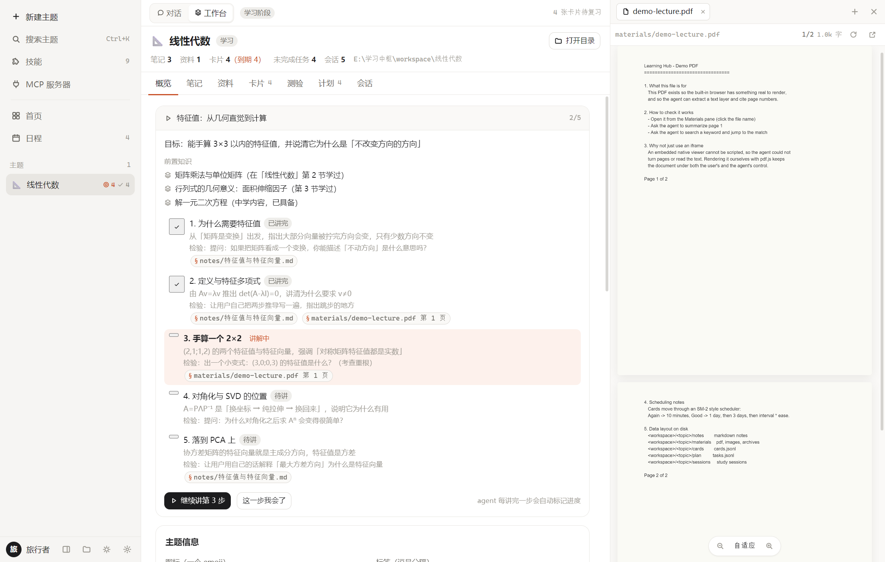

### 6. Knowledge base from your own lecture notes

Drop your slides, handouts and papers into the topic (drag and drop works). The knowledge base extracts
searchable text from `kb/`, `materials/` and `notes/` **with page numbers**, and caches it in
`.hub/kb.json` incrementally — only changed files are re-parsed.

The agent searches it with `kb_search` before answering, and quotes the source:

```
【来源：materials/病理学讲义.pdf 第 12 页】
```

Scanned PDFs without a text layer are flagged explicitly instead of being silently ignored.

### 7. Quizzes in real exam formats

Ask for a quiz and the agent writes it via `quiz_create`. Six question types:

| Type | Format |
| --- | --- |
| **A1** | single best answer, 5 options |
| **A2** | case vignette + single best answer |
| **B** | shared option set across several sub-questions |
| **X** | multiple correct answers (all-or-nothing marking) |
| **Term** | explain a term |
| **Short** | short answer |

**Objective questions are graded instantly on your machine** (set comparison — X-type demands an exact
match). **Subjective questions are graded by the model against a key-point list**, and it tells you which
points you missed. One button then sends every wrong answer back to the chat for an explanation.

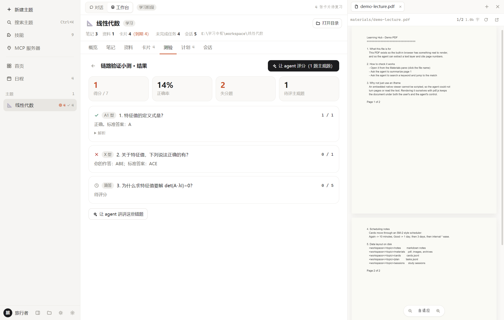

### 8. Flashcards, spaced repetition, Anki sync

- Three card kinds: **basic**, **reversed**, and **cloze** (`{{c1::...}}` markers, validated before they
  leave the app so you never get blank cards in Anki).
- **Reviewing happens inside the app — Anki is not required.** Scheduling is a local SM-2 variant, the
  review screen works from the keyboard (space to flip, 1–4 to grade, Esc to stop), and the four grade
  buttons show the *actual* next interval computed from that card's state ("again · 10 min",
  "good · 8 days").
- The review queue is snapshotted, so grading a card moves you forward instead of showing the same card
  again.
- External Anki is **optional**: the "Anki" menu on the cards pane can sync to AnkiConnect (Anki desktop
  + plugin) or export TSV for manual import. Ignoring it costs you nothing.

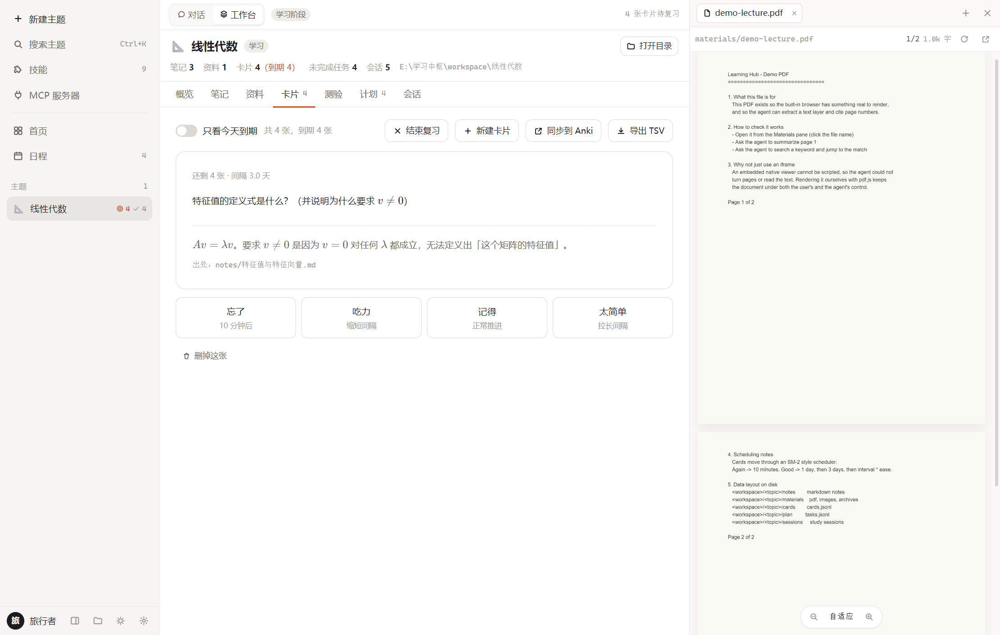

### 9. Mind maps and diagrams

`mindmap_create` takes an indented outline and produces a Mermaid mind map: saved as a note (rendered in
the editor *and* the viewer) and returned as text, so it also appears inline in the chat. Mermaid blocks
you write yourself — `flowchart`, `sequenceDiagram`, `timeline` — render everywhere too, with
fit / 100% / zoom controls.

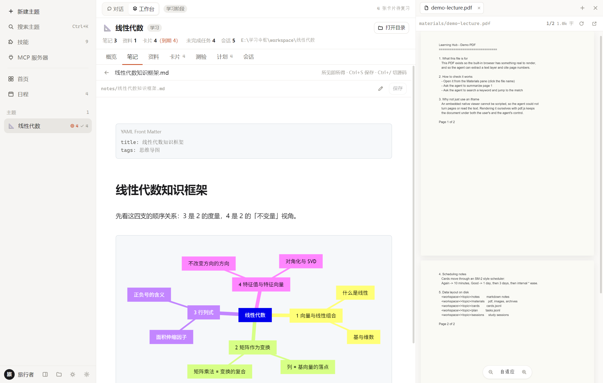

### 10. WYSIWYG Markdown editor

The note editor is built on **CodeMirror 6**, adapted from InkNote: formulas, tables, diagrams and code
blocks render *in place* — no split preview. Front matter becomes a compact widget, headings are
numbered automatically, and `Ctrl+/` switches to raw source when you want it.

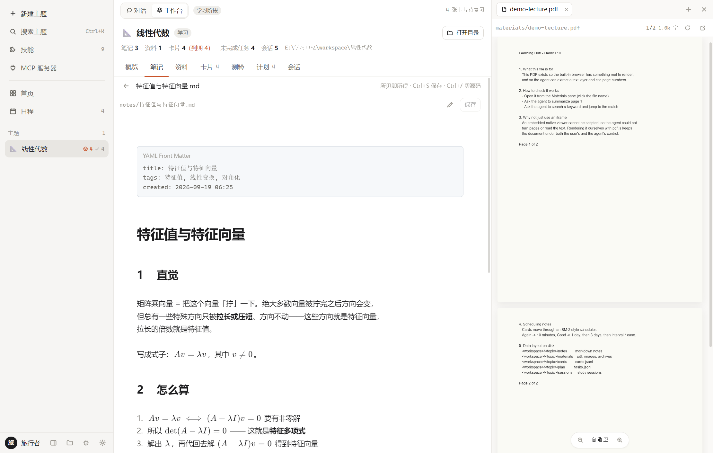

### 11. Skills and MCP

Both live in the sidebar, right under *New topic*, and both work at **two scopes**:

- **Global** — available in every topic.
- **This topic** — only inside the current topic. You can define something globally and still switch it
  off for a single topic, using the second switch on each row.

**Skills** are `SKILL.md` files (the same format as Claude / ZCode agent skills), so skills already on
your machine work as-is. **Only the ones that are switched on go into the prompt** (and only as a name
plus a one-line description — the agent reads the body with `skill_read` when it decides the skill
applies). The panel shows "N total, M on", and *Turn all off / Turn all on* lets you zero the list and
pick from there. The rule looks at switches only, never at which folder a skill came from, so skills you
add to any folder later fall under the same switches.

**MCP** servers are launched over stdio; their tools appear to the agent as `mcp__<server>__<tool>`.
External tools are treated as *writes*, so they always ask you first.

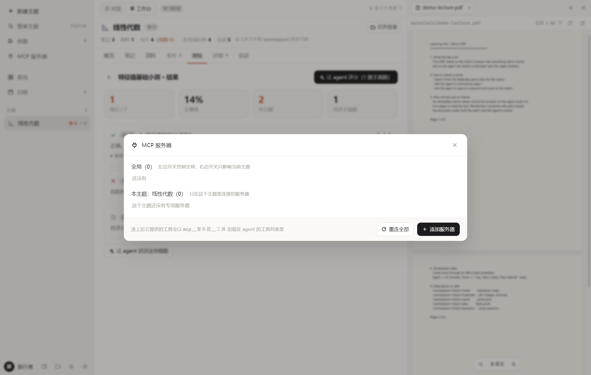

### 12. Long-term memory

The agent keeps notes **about you**, not just about the subject: what you already know, how you prefer to
be taught, which points you keep getting wrong, and which prerequisites are still missing. Every turn, the
relevant ones go into the system prompt — so it does not have to *remember to look them up*, and you do not
have to repeat yourself in every new chat.

Nothing hidden: each memory is one line of JSONL you can open in any editor, and the same list is shown and
editable in the sidebar's **Memory** panel (category, pin, edit, delete). Agent-written and hand-written
entries are indistinguishable — same file, same panel.

- **Two scopes**, decided by *where the file is*, not by a field in the record:
  `<workspace>/.hub/memory/memories.jsonl` (global) and `<topic>/.hub/memory/memories.jsonl` (this topic).
  A chapter inherits its parent course's memories, the same way it inherits materials.
- **Six categories** — fact / preference / goal / pitfall / style / gap — grouped in the prompt so the model
  knows *how* to use each one. Every entry carries the date it was recorded, so stale goals get questioned
  instead of obeyed.
- **Duplicates merge.** Same content written again (punctuation and wording aside) updates the existing
  entry. Pinned entries are always injected first; *used N times* tells you which entries never earned their
  place.
- **No background extraction call.** Memories are written by the agent while you talk (`memory_write`), so
  there is no extra model request, no extra API bill, and nothing you cannot see.

Turning it off stops the injection and hides the memory tools; the existing entries stay viewable.

### 13. Sandbox, permissions, schedule

- **Workspace sandbox (on by default).** The agent can only touch files inside your workspace. When it
  needs a lecture PDF from `D:\slides`, it asks — and approval is granted **per directory**, stored in
  your config and revocable at any time. Deletions inside the workspace go to `.hub/trash/`.
- **Permission levels** for tool calls: every time / auto-edit / full access.
- **Schedule view** buckets tasks into overdue / today / tomorrow / this week / later, plus a 30-day
  activity heat map. Tasks can come from you or from the agent.
- **Appearance**: follow system / light / dark — forced light works even when Windows is in dark mode.
- **A slim custom title bar**: no native caption (that OS-drawn strip could sit on top of the WebView2
  content), so minimise / maximise / close live in a 32px bar drawn by the app — and “maximise” fills the
  work area instead of covering the taskbar. The sidebar divider is draggable too.

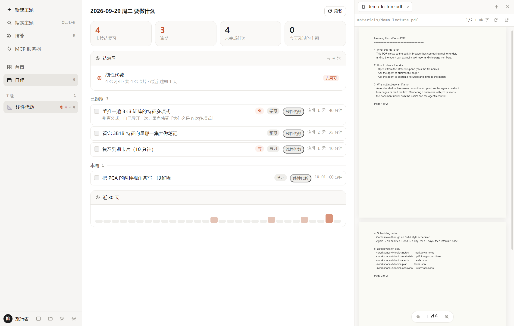

---

## Install

### Prebuilt Windows installer

Download `LearningHub-<version>-x64-setup.exe` from [Releases](../../releases) and run it. The installer
is per-user (no admin rights). Requires Windows 10/11 with the WebView2 runtime — preinstalled on
Windows 11 and on most updated Windows 10 machines.

### Build from source

```bash
git clone https://github.com/Simon37645/learning-hub.git
cd learning-hub
npm install          # put a proxy in .npmrc if your registry is slow
npm run app:dev      # development mode
npm run dist         # build + collect the installer into release/
npm run shortcut     # copy the built app to release/app and add a desktop shortcut
```

`npm run dist` runs `tauri build` and then copies the NSIS installer to
`release/LearningHub-<version>-x64-setup.exe` (an ASCII name — the bundler's own output uses the Chinese
product name, which GitHub strips from release assets), printing its size and SHA256.

Requires Node 20+, Rust 1.77+ and (on Windows) the MSVC toolchain. The first Rust build takes several
minutes.

### Try it without an API key

The UI, built-in browser, notes, cards and quizzes all work offline. To see the app with data:

```bash
npm run demo:seed && npm run demo:pdf     # sample topic in workspace/
npm run dev:fake-llm                      # local OpenAI-compatible fake model
```

Then point **Settings → Workspace** at `workspace/` and **Settings → Model profiles** at
`http://127.0.0.1:4321/v1` with model `fake-model`. That exercises the whole agent loop — streaming,
tool calls, approvals — without spending anything.

---

## Configuration

Everything lives in one JSON file, editable from **Settings**:

| Section | What it does |
| --- | --- |
| Model profiles | Any number of OpenAI-compatible or Anthropic endpoints. Keys never reach the UI (only a masked hint). **Test connection** sends one ping. |
| Agent | Permission level, max tool round-trips, request timeout, context budget, extra system instructions, web access. |
| Workspace sandbox | Master switch plus the directories you approved. |
| Anki | AnkiConnect URL and an optional deck-name prefix. |
| Appearance | Theme mode. |

The workspace defaults to `Documents\学习中枢` and can be changed at any time.

---

## How it works

```
src/                       React 19 front end
  store/app.ts             single source of truth + event subscriptions
  components/              sidebar, chat, viewer, workbench, quiz, settings
  inknote/                 CodeMirror editor adapted from InkNote
src-tauri/src/
  commands/                IPC surface (92 commands)
  agent/                   conversation loop, providers (SSE), tools, prompts
  viewer/                  built-in browser state machine + readability extractor
  domain/                  topics, notes, cards, tasks, sessions, quizzes
  kb.rs  mcp.rs  skills.rs  anki.rs  store.rs  paths.rs  net.rs
```

Data layout — all plain files:

```
<workspace>/<topic>/
├── topic.json          metadata (stage, tags, per-topic tool switches, parent topic id)
├── README.md           background the agent reads every turn
├── notes/  materials/  kb/  lessons/  cards/  plan/  sessions/  quizzes/
└── .hub/               chats, knowledge-base cache, trash, skills
```

Design notes — the event protocol, the agent loop, how to add a tool — are in
[docs/ARCHITECTURE.md](docs/ARCHITECTURE.md).

---

## Development

```bash
npm run typecheck                 # TypeScript
npm run rust:check                # cargo check
npm run rust:test                 # 29 Rust unit tests
npm run test:ui                   # 90 tests ported from InkNote (editor + renderer)
npm run test:e2e                  # 15-assertion end-to-end chat smoke (app must listen on :9222)
npm run demo:seed                 # sample topic
npm run dev:fake-llm              # offline fake model
```

To debug the UI, start the app with
`WEBVIEW2_ADDITIONAL_BROWSER_ARGUMENTS=--remote-debugging-port=9222` and drive it with
`scripts/cdp.mjs` (`metrics`, `eval`, `click`, `text`, `type`, `screenshot`) — that is how the images
in this README were produced. See [AGENTS.md](AGENTS.md) for conventions and for the traps this codebase
has already fallen into once.

---

## Roadmap

- English UI (strings are already centralised)
- Voice / image input (multimodal messages)
- Review reminders (system notification when cards are due)
- Weekly / monthly report from session history
- MCP Streamable HTTP transport
- Text extraction for client-rendered (SPA) pages

---

## Acknowledgements

### Thanks to the community

**[LINUXDO](https://linux.do)** — for the community, the discussions and the encouragement.
A lot of small decisions in this app (keeping everything as plain files, making the agent show its
citations, putting the sandbox in front of raw power) come from talking with people who actually study
and build things. Thank you.

### Adapted from, or built on the shoulders of

| Project | Used for |
| --- | --- |
| **[InkNote](https://github.com/Simon37645)** | The Markdown editor under `src/inknote/`. Its CodeMirror widget architecture, editor commands and styles were adapted; file I/O was rewired to this app's topic model and its unified/remark export pipeline was replaced by the existing marked one. |
| **[Anthropic Agent Skills](https://www.anthropic.com/)** | The `SKILL.md` convention (frontmatter + progressive disclosure). Learning Hub reads the same format, so skills already on your machine work as-is. |
| **[Model Context Protocol](https://modelcontextprotocol.io/)** | The protocol spoken by `src-tauri/src/mcp.rs` — a hand-written stdio JSON-RPC client. |
| **[SuperMemo 2](https://super-memory.com/english/ol/sm2.htm)** | The spaced-repetition algorithm by Piotr Woźniak, which `domain/card.rs` implements as a variant. |
| **[AnkiConnect](https://foosoft.net/projects/anki-connect/)** | The local HTTP API used for direct Anki sync. |

### Open-source software used

**Shell & backend** — [Tauri](https://tauri.app/) (MIT/Apache-2.0) · [tokio](https://tokio.rs/) ·
[reqwest](https://github.com/seanmonstar/reqwest) · [serde](https://serde.rs/) ·
[chrono](https://github.com/chronotope/chrono) · [parking_lot](https://github.com/Amanieu/parking_lot) ·
[walkdir](https://github.com/BurntSushi/walkdir) · [regex](https://github.com/rust-lang/regex) ·
[uuid](https://github.com/uuid-rs/uuid) · [thiserror](https://github.com/dtolnay/thiserror) ·
[encoding_rs](https://github.com/hsivonen/encoding_rs) · [url](https://github.com/servo/rust-url)
（插件：[dialog](https://github.com/tauri-apps/plugins-workspace) · opener · clipboard-manager）

**Content processing** — [pdf.js](https://mozilla.github.io/pdf.js/) (PDF rendering + text layer) ·
[pdf-extract](https://github.com/jrmuizel/pdf-extract) (PDF text for the knowledge base) ·
[scraper](https://github.com/causal-agent/scraper) + [html5ever](https://github.com/servo/html5ever)
(web readability extraction)

**Front end** — [React](https://react.dev/) · [zustand](https://github.com/pmndrs/zustand) ·
[CodeMirror 6](https://codemirror.net/) · [Lezer](https://lezer.codemirror.net/) ·
[Mermaid](https://mermaid.js.org/) · [KaTeX](https://katex.org/) · [marked](https://marked.js.org/) ·
[marked-katex-extension](https://github.com/UziTech/marked-katex-extension) ·
[highlight.js](https://highlightjs.org/) · [DOMPurify](https://github.com/cure53/DOMPurify) ·
[html-to-image](https://github.com/bubkoo/html-to-image) · [Vite](https://vite.dev/) ·
[TypeScript](https://www.typescriptlang.org/) · [Vitest](https://vitest.dev/) ·
[happy-dom](https://github.com/capricorn86/happy-dom)

Every dependency keeps its own license (mostly MIT or Apache-2.0, chosen in the dual-licence case);
this project's GPL-2.0-only applies to its own code.

### Assets

Sample data in this repository (`scripts/seed-demo.mjs`, `scripts/make-demo-pdf.mjs`) is generated by
those scripts — no third-party content is bundled, and the screenshots are of the real app.

---

## License

[GNU General Public License v2.0](LICENSE) © Simon37645

This program is free software; you can redistribute it and/or modify it under the terms of the GNU
General Public License as published by the Free Software Foundation; version 2 of the License.
It is distributed in the hope that it will be useful, but **without any warranty**.
