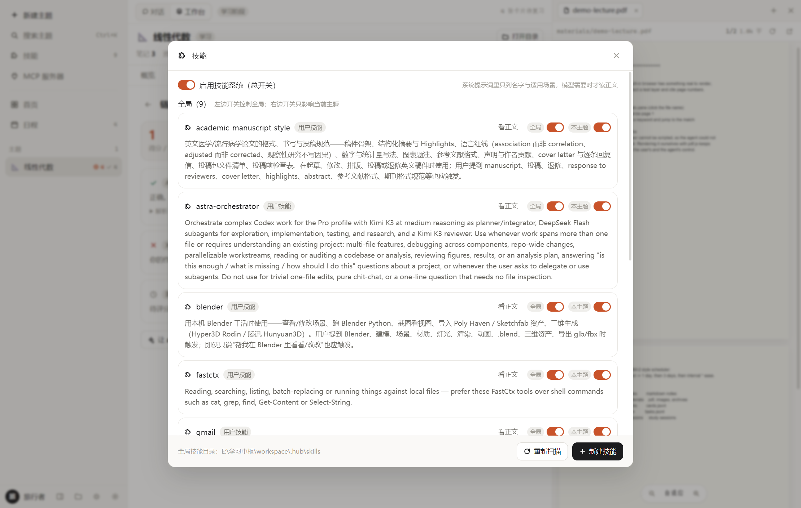

<div align="center">


# 学习中枢 · Learning Hub

**一个把「预习 → 学习 → 复习 → 测验」串成一条线的本地优先 AI 学习助手。**

它会先出讲解方案再开讲，引用时会标出读到的是哪一页，把笔记和卡片写成纯 Markdown，
还会按医学考试的题型给你出卷。

[](LICENSE)
[](#安装)
[](https://tauri.app)
[](src-tauri)
[](src)

[English](README.md) · [架构说明](docs/ARCHITECTURE.md) · [开发约定](AGENTS.md)

</div>

---

## 目录

- [为什么要再做一次](#为什么要再做一次)
- [功能导览](#功能导览)
  - [1. 一个主题就是一个目录](#1-一个主题就是一个目录)
  - [2. 会动手的对话](#2-会动手的对话)
  - [3. agent 能操作的内置浏览器](#3-agent-能操作的内置浏览器)
  - [4. 讲解模式：先出方案，再一步一停](#4-讲解模式先出方案再一步一停)
  - [5. 用你自己的讲义做知识库](#5-用你自己的讲义做知识库)
  - [6. 真正的考试题型测验](#6-真正的考试题型测验)
  - [7. 卡片、间隔重复、Anki 同步](#7-卡片间隔重复anki-同步)
  - [8. 思维导图与图示](#8-思维导图与图示)
  - [9. 所见即所得的 Markdown 编辑器](#9-所见即所得的-markdown-编辑器)
  - [10. 技能与 MCP](#10-技能与-mcp)
  - [11. 沙箱、权限、日程](#11-沙箱权限日程)
- [安装](#安装)
- [配置](#配置)
- [实现结构](#实现结构)
- [开发](#开发)
- [后续计划](#后续计划)
- [致谢](#致谢)
- [许可](#许可)

---

## 为什么要再做一次

大多数 AI 客户端关掉就不记得你是谁，大多数笔记软件也没读过你的教材。学习中枢在两者之间：
它是一个**记忆存在你磁盘上**的 agent，而组织方式贴着真实的学习流程来。

三个决定影响了全部设计：

| 决定 | 为什么 |
| --- | --- |
| **一个主题就是一个目录** | 笔记是 `.md`，卡片是 `.jsonl`，资料就是原始 PDF。用 VS Code 打开这个文件夹、随便怎么同步，甚至删掉应用，干活的结果都还在。 |
| **它是学习搭档，不是聊天机器人** | 它会写笔记、做卡片、排复习；系统提示词要求它一次只讲一小步、然后向你提问，而不是一次倒出十条要点。 |
| **凡是引用都要能回溯** | 读到讲义第 12 页就写第 12 页，而且那个标注点一下就能在内置浏览器里打开原文。 |

Rust 后端（不是 Electron）+ Tauri 2 外壳 + React 19 前端。除了你自己配的模型接口，全部本地运行。

---

## 功能导览

### 1. 一个主题就是一个目录

侧栏列出你的主题，每个主题对应一个目录。主题标题栏直接告诉你里面有什么：笔记、资料、
今天到期的卡片、未完成任务、会话数。


点「新建主题」创建，用 **Ctrl+K** 跨主题搜索笔记正文；也可以从资源管理器里把文件**直接拖进窗口**，
它们会被复制进该主题的 `materials/`。

### 2. 会动手的对话

agent 有 43 个内置工具，按用途分组：文件、学习资产、内置浏览器、联网、测验、知识库、讲解方案、
思维导图、技能与 MCP。

- **每次写入都会显示成一张卡片**，带它动了什么、花了多久、成没成。
- **写操作先问你**：每次确认 / 自动编辑 / 完全访问三档。
- **思考强度**就在模型选择器旁边：关闭 / 低 / 中 / 高 / 最高。默认关闭——
  这个参数不是标准字段，只有你打开后才会写进请求；用哪种写法
  （`reasoning_effort` / `enable_thinking` / Anthropic 的 `thinking`）可以在设置里按档案改。
- **它产出的东西就是你的文件**：笔记、卡片、试卷都是普通文件，随手就能改。


段落末尾那小胶囊就是来源标注，点一下内置浏览器就翻到那一页。

### 3. agent 能操作的内置浏览器

PDF、Markdown、网页、图片、代码，带标签页，就在右侧面板里。

- **PDF** 用 pdf.js 逐页渲染，所以 agent 能翻到第 12 页并引用它。文字层是真的——可以选中、复制，
  检索命中会直接标在那一行文字上。
- **网页**内嵌打开，另有「阅读模式」显示 agent 实际提取到的正文。
- **`viewer_*` 系列工具**让 agent 能打开文件、翻页、在文档里检索并滚到命中处，你全程看得见。


### 4. 讲解模式：先出方案，再一步一停

预习阶段默认走讲解模式，agent 必须按顺序做三件事：

1. **先检索你的讲义**，弄清老师划了哪些重点；
2. **写一份讲解方案**：4~8 步，每步写清「讲什么」和「怎么检验听懂了」。方案会落盘，
   并且每轮都注入提示词，所以它跨对话也不会讲丢；
3. **讲完一步就停下来问**，你回答之后才继续下一步。

需要动态演示时，它会写一个可交互的 HTML 演示页（能拖参数、带动画）到 `lessons/` 并打开给你看。
它还会点出前置知识——「这个你在「微积分」那个主题里学过，就是当时那条定理」——
靠的是读你其它主题的笔记。


### 5. 用你自己的讲义做知识库

把课件、讲义、论文丢进主题（拖放即可）。知识库会把 `kb/`、`materials/`、`notes/` 里的内容
抽成**带页码**的可检索文本，缓存在 `.hub/kb.json`，而且只重新解析改动过的文件。

agent 回答前会先用 `kb_search` 查一遍，并标出处：

```
【来源：materials/病理学讲义.pdf 第 12 页】
```

没有文字层的扫描件会被明确标出来，而不是悄悄跳过。

### 6. 真正的考试题型测验

让它出题，它用 `quiz_create` 存成试卷。支持六种题型：

| 题型 | 形式 |
| --- | --- |
| **A1** | 单句型最佳选择题（5 选项） |
| **A2** | 病例/场景摘要 + 最佳选择题 |
| **B** | 标准配伍题（一组选项配若干小题） |
| **X** | 多项选择题（多选漏选都不得分） |
| **名词解释** | 按采分点给分 |
| **简答题** | 按采分点给分 |

**客观题在本机即时判分**（集合比对，X 型要求完全一致）；**主观题由模型对着采分点逐条给分**，
并告诉你漏了哪几点。之后一键就能把所有错题丢回对话里让它讲。


### 7. 卡片、间隔重复、Anki 同步

- 三种卡片：**基础**、**反向**、**完形**（`{{c1::...}}` 标记，导出前会校验，不会到 Anki 那边变成空白卡）。
- 调度用本地计算的 SM-2 变体；复习队列进复习时会**快照**下来，评完一张就前进一张，
  不会反复出现同一张卡。
- **AnkiConnect 直连**只推送从没同步过的卡片。Anki 没开时会告诉你该装哪个插件。
  也保留了纯 TSV 导出，喜欢手动导入也可以。


### 8. 思维导图与图示

`mindmap_create` 接收缩进大纲，生成 Mermaid 思维导图：存成一篇笔记（编辑器与内置浏览器都会渲染），
同时把图定义返回给你，所以它也能直接出现在对话里。你自己写的 Mermaid 代码块
（`flowchart`、`sequenceDiagram`、`timeline`）同样到处都能渲染，还带适应宽度 / 100% / 放大按钮。


### 9. 所见即所得的 Markdown 编辑器

笔记编辑器基于 **CodeMirror 6**，移植自 InkNote：公式、表格、图表、代码块都在**正文里原地渲染**，
不需要分栏预览。front matter 变成一个小部件，标题自动编号，`Ctrl+/` 随时切回源码。


### 10. 技能与 MCP

两个入口都在侧栏顶部（「新建主题」下面），都分**两级作用域**：

- **全局**：所有主题都能用。
- **本主题**：只在当前主题生效。全局定义的东西也能在某个主题里单独关掉——
  列表里每行有两个开关，左边管全局，右边只管当前主题。

**技能**就是 `SKILL.md`（与 Claude / ZCode 的 Agent Skills 同一格式），所以你机器上已有的技能
搬过来就能用。提示词里只列名字与一句话说明，模型判断用得上时才会用 `skill_read` 读正文。

**MCP** 服务器走 stdio 启动，它提供的工具会以 `mcp__服务器__工具` 出现。外部工具按「写入」级别处理，
一定会先问你。



### 11. 沙箱、权限、日程

- **工作区沙箱（默认开启）**：agent 只能碰工作区里的文件。它需要 `D:\课件` 里的讲义时会向你申请，
  批准**粒度是目录**，记在配置里、随时可撤销。工作区内的删除会进 `.hub/trash/`。
- **工具权限**三档：每次确认 / 自动编辑 / 完全访问。
- **日程视图**把任务分成已逾期 / 今天 / 明天 / 本周 / 以后，另有一条 30 天活跃度热力图。
  任务可以你建，也可以 agent 排。
- **外观**：跟随系统 / 明亮 / 深色——系统是深色时也能强制明亮。


---

## 安装

### 直接装 Windows 安装包

到 [Releases](../../releases) 下载 `LearningHub-<版本>-x64-setup.exe` 运行即可。安装到当前用户，不需要管理员权限。
需要 Windows 10/11 与 WebView2 运行时（Windows 11 自带，打过补丁的 Win10 一般也有）。

### 从源码构建

```bash
git clone https://github.com/Simon37645/learning-hub.git
cd learning-hub
npm install          # 网络慢的话在 .npmrc 里配代理
npm run app:dev      # 开发模式
npm run dist         # 打包并把安装包收集到 release/
```

`npm run dist` 会跑一次 `tauri build`，然后把 NSIS 安装包复制成
`release/LearningHub-<版本>-x64-setup.exe`（ASCII 名：打包器自己的产物名是中文产品名，
而 GitHub 上传附件时会剥掉非 ASCII 字符），并打印大小与 SHA256。

需要 Node 20+、Rust 1.77+，Windows 上还需要 MSVC 工具链。首次编译 Rust 要几分钟。

### 不花 API 费用先看看

界面、内置浏览器、笔记、卡片、测验都不依赖模型。想看有数据的样子：

```bash
npm run demo:seed && npm run demo:pdf     # 在 workspace/ 里造一个示例主题
npm run dev:fake-llm                      # 本地假模型（OpenAI 兼容）
```

然后把「设置 → 工作区」指到 `workspace/`，「设置 → 模型档案」指向 `http://127.0.0.1:4321/v1`、
模型名填 `fake-model`。这样就能把整条 agent 链路（流式、工具调用、审批弹窗）跑一遍，一分钱不花。

---

## 配置

配置都在一个 JSON 文件里，从**设置**页就能改：

| 分节 | 作用 |
| --- | --- |
| 模型档案 | 可以配多个 OpenAI 兼容或 Anthropic 接口。密钥不会进前端（只给脱敏提示），自带「测试连接」。 |
| Agent 行为 | 权限档位、单轮工具往返上限、请求超时、上下文预算、额外系统指令、是否允许联网。 |
| 工作区沙箱 | 总开关 + 你批准过的目录列表。 |
| Anki | AnkiConnect 地址与可选的牌组名前缀。 |
| 外观 | 主题模式。 |

工作区默认在 `我的文档\学习中枢`，随时可改。

---

## 实现结构

```
src/                       前端（React 19）
  store/app.ts             唯一状态源 + 事件订阅
  components/              侧栏、对话、内置浏览器、工作台、测验、设置
  inknote/                 移植自 InkNote 的 CodeMirror 编辑器
src-tauri/src/
  commands/                IPC 接口（92 个命令）
  agent/                   对话循环、模型接入（SSE）、工具、提示词
  viewer/                  内置浏览器状态机 + 网页正文提取
  domain/                  主题、笔记、卡片、任务、会话、测验
  kb.rs  mcp.rs  skills.rs  anki.rs  store.rs  paths.rs  net.rs
```

数据布局（全是普通文件）：

```
<工作区>/<主题>/
├── topic.json          元数据（阶段、标签、主题级工具开关）
├── README.md           agent 每轮都会读的背景资料
├── notes/  materials/  kb/  lessons/  cards/  plan/  sessions/  quizzes/
└── .hub/               对话记录、知识库缓存、回收站、技能
```

事件协议、agent 循环、怎么加一个工具，都写在 [docs/ARCHITECTURE.md](docs/ARCHITECTURE.md)。

---

## 开发

```bash
npm run typecheck                 # TypeScript 类型检查
npm run rust:check                # cargo check
npm run rust:test                 # Rust 单测 29 项
npm run test:ui                   # 移植自 InkNote 的 90 项测试（编辑器 + 渲染）
npm run test:e2e                  # 端到端对话冒烟 15 项断言（应用需监听 :9222）
npm run demo:seed                 # 造示例数据
npm run dev:fake-llm              # 本地假模型
```

调 UI 不要靠截图目测：用
`WEBVIEW2_ADDITIONAL_BROWSER_ARGUMENTS=--remote-debugging-port=9222` 启动应用，再用
`scripts/cdp.mjs`（`metrics` / `eval` / `click` / `text` / `type` / `screenshot`）直接量 DOM、点按钮。
本 README 里的截图就是这么来的。开发约定与「已经踩过的坑」见 [AGENTS.md](AGENTS.md)。

---

## 后续计划

- 英文界面（文案已经集中管理）
- 语音 / 图片输入（多模态消息）
- 复习提醒（到点系统通知）
- 从会话历史生成周报 / 月报
- MCP 的 Streamable HTTP 传输
- 纯前端渲染（SPA）网页的正文提取

---

## 致谢

### 感谢社区

**[LINUXDO](https://linux.do)** —— 感谢这个社区、里面的讨论和鼓励。
这个应用里不少小决定（什么都要留成普通文件、agent 必须标出来源、把沙箱摆在「能力」前面）
都是跟真正在学习和动手的人聊出来的。谢谢。

### 参考与移植

| 项目 | 用在哪 |
| --- | --- |
| **[InkNote](https://github.com/Simon37645)** | `src/inknote/` 里的 Markdown 编辑器。沿用了它的 CodeMirror 组件架构、编辑命令与样式；文件读写改成学习中枢的主题模型，导出管线换成已有的 marked 管线。 |
| **[Anthropic Agent Skills](https://www.anthropic.com/)** | `SKILL.md` 的约定（frontmatter + 渐进式披露）。学习中枢读同一套格式，所以你机器上已有的技能搬过来就能用。 |
| **[Model Context Protocol](https://modelcontextprotocol.io/)** | `src-tauri/src/mcp.rs` 实现的协议——手写的 stdio JSON-RPC 客户端。 |
| **[SuperMemo 2](https://super-memory.com/english/ol/sm2.htm)** | Piotr Woźniak 的间隔重复算法，`domain/card.rs` 是它的一个变体实现。 |
| **[AnkiConnect](https://foosoft.net/projects/anki-connect/)** | 直连 Anki 同步用的本地 HTTP 接口。 |

### 用到的开源软件

**外壳与后端** —— [Tauri](https://tauri.app/)（MIT/Apache-2.0）· [tokio](https://tokio.rs/) ·
[reqwest](https://github.com/seanmonstar/reqwest) · [serde](https://serde.rs/) ·
[chrono](https://github.com/chronotope/chrono) · [parking_lot](https://github.com/Amanieu/parking_lot) ·
[walkdir](https://github.com/BurntSushi/walkdir) · [regex](https://github.com/rust-lang/regex) ·
[uuid](https://github.com/uuid-rs/uuid) · [thiserror](https://github.com/dtolnay/thiserror) ·
[encoding_rs](https://github.com/hsivonen/encoding_rs) · [url](https://github.com/servo/rust-url)
（官方插件：dialog · opener · clipboard-manager）

**内容处理** —— [pdf.js](https://mozilla.github.io/pdf.js/)（PDF 渲染与文字层）·
[pdf-extract](https://github.com/jrmuizel/pdf-extract)（给知识库抽 PDF 文字）·
[scraper](https://github.com/causal-agent/scraper) + [html5ever](https://github.com/servo/html5ever)
（网页正文提取）

**前端** —— [React](https://react.dev/) · [zustand](https://github.com/pmndrs/zustand) ·
[CodeMirror 6](https://codemirror.net/) · [Lezer](https://lezer.codemirror.net/) ·
[Mermaid](https://mermaid.js.org/) · [KaTeX](https://katex.org/) · [marked](https://marked.js.org/) ·
[highlight.js](https://highlightjs.org/) · [DOMPurify](https://github.com/cure53/DOMPurify) ·
[html-to-image](https://github.com/bubkoo/html-to-image) · [Vite](https://vite.dev/) ·
[TypeScript](https://www.typescriptlang.org/) · [Vitest](https://vitest.dev/) ·
[happy-dom](https://github.com/capricorn86/happy-dom)

各依赖保留自己的许可（多数是 MIT / Apache-2.0，双许可时择一使用）；本项目的 GPL-2.0-only
只覆盖它自己的代码。

### 其它

- 仓库里的示例数据（`scripts/seed-demo.mjs`、`scripts/make-demo-pdf.mjs`）都是自己生成的，
  没有打包任何第三方内容；README 里的截图是真实界面。

---

## 许可

[GNU 通用公共许可证 v2.0](LICENSE) © Simon37645

本程序是自由软件：你可以按照自由软件基金会发布的 GNU 通用公共许可证（第 2 版）的条款
重新发布和/或修改它。希望它有用，但**不提供任何担保**。
