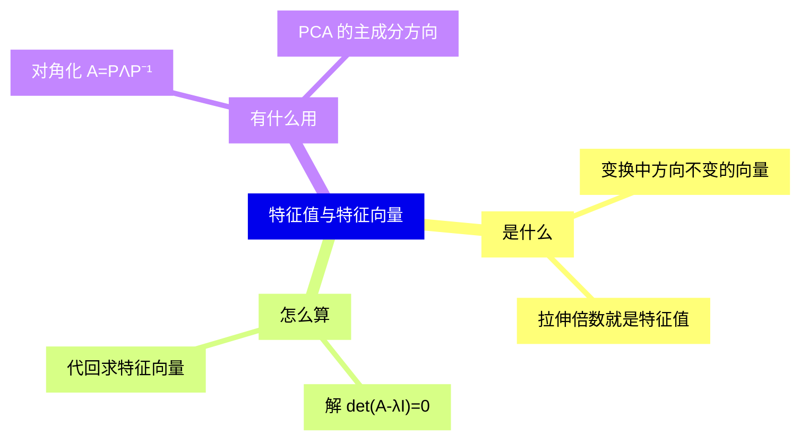

好的，先把地图给你，然后我们一步一步来。

这张图里，「解 det(A-λI)=0」是整条链的枢纽——它把「找方向」变成了「解方程」【来源：materials/demo-lecture.pdf 第 1 页】。

| 概念 | 一句话 |
| --- | --- |
| 特征向量 | 变换后方向不变的向量 |
| 特征值 | 这个方向被拉伸的倍数 |
| 特征多项式 | det(A−λI)，它的根就是特征值 |

$$Av = \lambda v \iff \det(A - \lambda I) = 0$$

我们先只解决第一个问题：为什么定义里要求 $v \neq 0$？你先想一分钟，我再讲我的答案。
